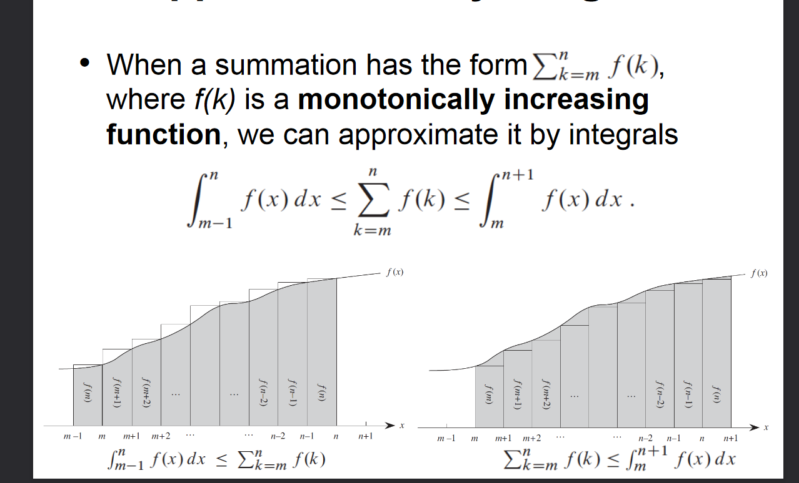
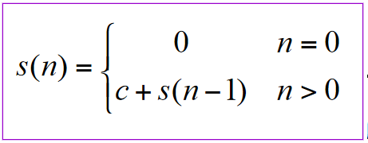
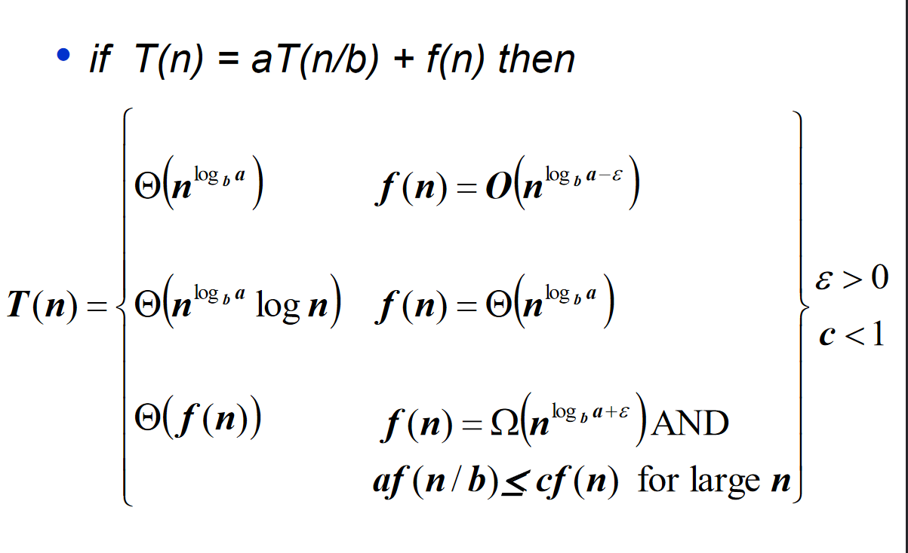

# Complexity of Recursive Algorithms

## Perturbation Method
* A method to get a formula for a given summation sequence.
* Done by equating two expressions for Sn+1 by taking its first and last terms.
* Consider Sn = $\sum_{k=0}^n x^k$
* Sn+1 = Sn + $x^{n+1}$ considering the last element
* Sn+1 = $x^0 + \sum_{k=1}^{n+1} x^k$ considering the first element
* Equating both sides we get Sn + $x^{n+1}$ = $x^0 + \sum_{k=1}^{n+1} x^k$
* Sn + $x^{n+1}$ = $1 + \sum_{k=1}^{n+1} x^k$
* Sn + $x^{n+1}$ = $1 + \sum_{k=0}^{n} x^{k+1}$
* Sn + $x^{n+1}$ = 1 + xSn
* Sn = ${(x^{n+1}-1)}/{(x-1)}$

## Approximation by Integrals

* When a summation has a form $\sum_{k=m}^n f(k)$ where f(k) is a monotonically increasing function, it can be approximated by integrals.

## Recursion Time Complexity with Iteration
* A method to get the time complexity of a recurrence relation.
* Find a pattern for the recurrence relation in terms of `k` where `k` is the amount of iterations.
* Equate `k=n` where `n` is given in the equation as the scaling factor.
* Use the final result as the `big O notation`.

### Iteration Example

* $s(n) = c + s(n-1)$
* $s(n) = c + c +  s(n-2)$
* $s(n) = c + c + c + s(n-3)$
* $s(n) = kc + s(n-k)$
* When k = n, we have $s(n) = nc + s(0)$
* $s(n) = nc$
* Thus $S(n)$ is of the form $O(n)$

## Master Method
* The master method provides a cookbook method for solving recurrences of the form $T(n) = aT(n/b) +f(n)$
* It uses the properties of $f(n)$ wherein if there is an $ε >0$ for the following functions in f, then the corresponding complexity for T(n) applies.
