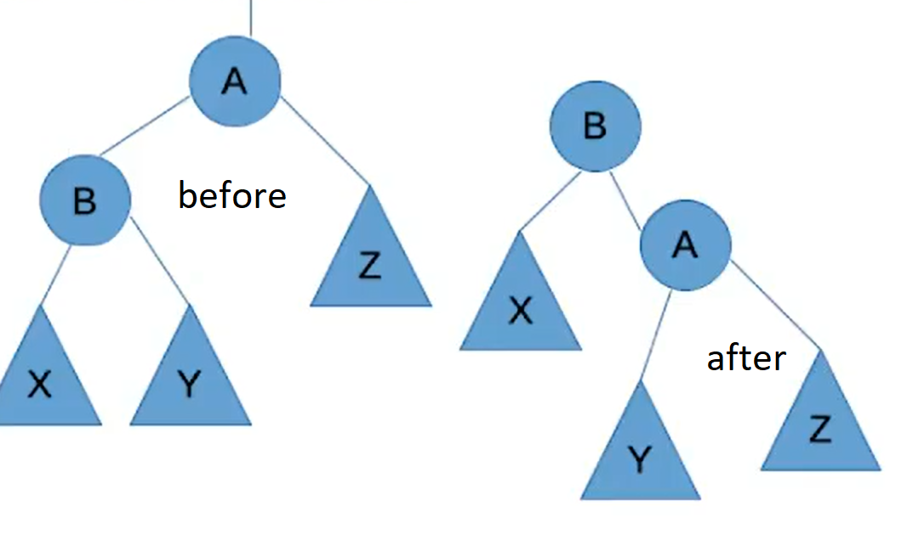
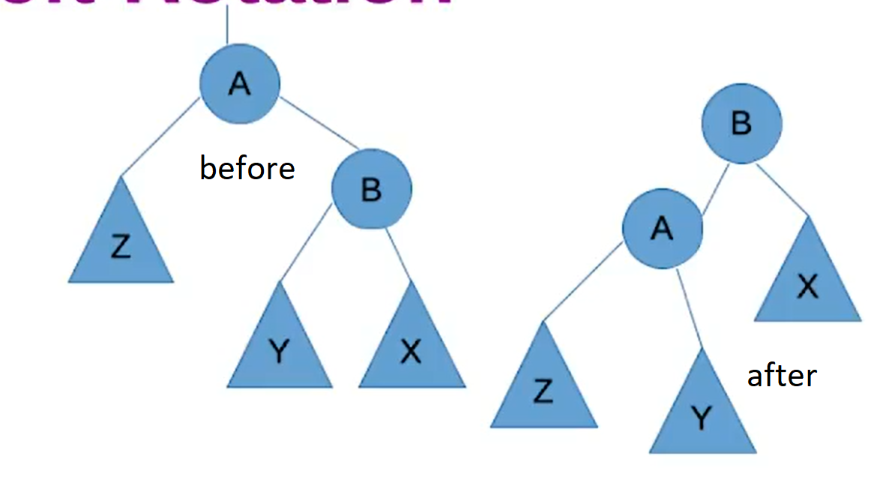

# AVL Trees

* The balance of an node is the height of its left child minus the height of its right child.
* AVL trees ensure that the balance at all nodes is between -1 and 1.
* AVL Trees maintain their balance by doing `rotation` operations.
* The height of an AVL tree is always $O(log(n))$

## Tree Rotations
* A tree manipulation algorithm that changes the root of a subtree.

### Right Rotation

* Used when left heavy.
* The root node's left child's right child becomes the root nodes left child.
* The root node's left child becomes the new root and the old root becomes the new root's right child.

### Left Rotation

* Used when right heavy
* The root node's right child's left node becomes the root node's right child.
* The root node's right child becomes the new root and the old root becomes the new root's left child.
