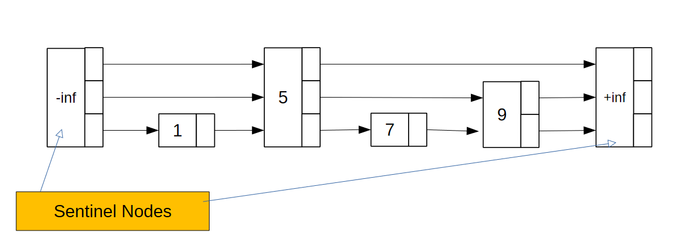

# Skip Lists

* SKips lists are a generalization of a sorted linked list.
* It is a list that has nodes with a value in increasing order that have a variable number of pointers to future nodes.
* The amount of pointers a node has is random and is thus based on probability.
* The top pointer skips the most followed by the following pointers.

## Searching through a skip list
* Start at the top pointer of the leftmost element.
* If what is being searched for is more than what is pointed to, then take the pointer to the next element.
* If it is less, then move downwards and try the next pointer.
* Continue until reaching positive infinity (the last node) or the node is found.

## Inserting into a skip list
* Use the search procedure to find the correct place to insert the element.
* Insert it into level 0, use a coin flip to decide its height and fix the pointers that are pointing into it. This can be done by keeping a stack where when moving downwards during search, the element that was moved down on is added to the stack.
* These elements in the stack then point to this new element.

## Complexity of a Skip List

### Search
* `Worst Case`: all n towers are h high = $O(n+h)$
* `Average Case`: We encounter expectedly 2 elements per level hence the average is $O(log(n))$
    
### Space
* It is always `O(n)`.