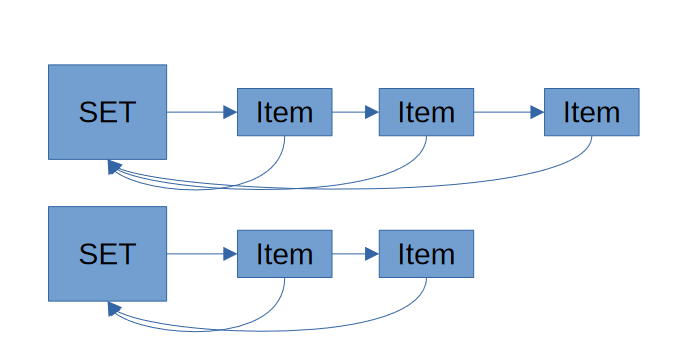

# Disjoint Sets

* A collection of disjoint sets that can be merged.

## Implementing Disjoint Sets with AVL Trees

* Key value pairs have an `item` and `set belonged to`.
* Eg item 3 belongs to set A.
* Find operations will be $O(log(n))$
* Union will need to find all items within the first set and change the set value to the second set.
* Hence union is in $O(n)$

## Implementing Disjoint Sets with Hash Maps
* Item can map to the index in the array.
* Set can be held within the array.
* Find operations will be $O(1)$
* Union operations will be $O(n)$

## Fast Find using Linked Structures

* Implementation using linked lists.
* Find is $O(1)$. 
* Union is still $O(n)$

## Fast Union using Rooted Trees

* Uses pointers to join sets.
* Union Complexity = $Find + O(1)$
* Find can be done in $O(1)$ using arrays.
