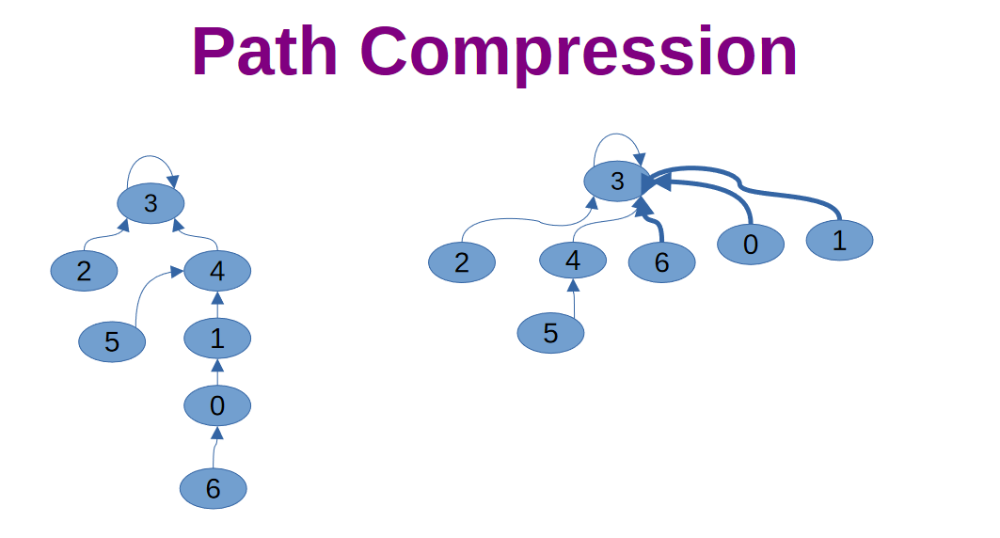
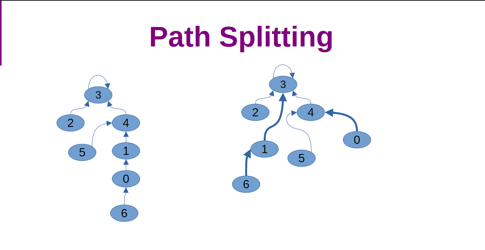
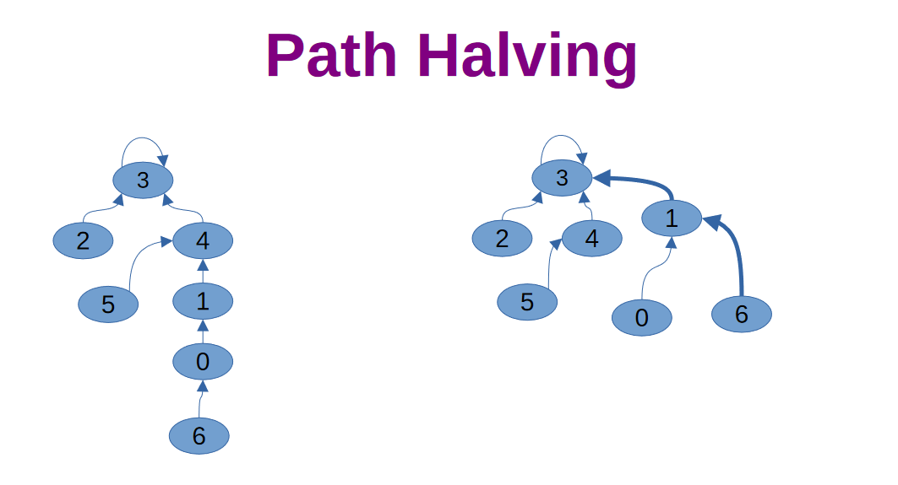

# Path Compression

* Techniques used on rooted trees to reduce the time complexity of find operations.
* Allows for find and unions to be fast at the same time.

## Path Compression

* Takes the path of nodes that point to a root and points the individual nodes to the root.
* It is slow as it takes 2 passes to operate.

## Path Splitting

* Move the nodes parent pointer to its grandparent. and move the node's pointer to its former grandparent.
* Effectively splits the path in 2.
* Uses only 1 pass but leads to longer paths than path compression.

## Path Halving

* Move the node's pointer to its grandparent.
