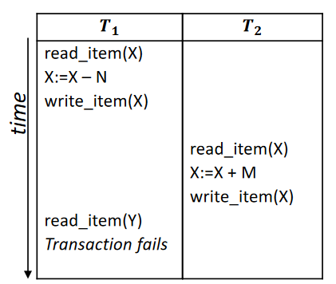

# Transaction Processing

* Transactions are a mechanism for describing logical units of database processing.
* They can be run `concurrently` via `interleaving`.
* They are either `read-only` or `read-write` transactions.
* All operations of a transaction must be completed successfully for the data on the database to change. If an operation fails, the transaction must be `aborted` without updating the database.

## Desireable Properties of Transactions
* `Atomicity`: Transactions cannot be further divided, hence they either fail or succeed entirely.
* `Consistency Preservation`: Transactions take the database from one consistent state to another.
* `Isolation`: Transactions appear as if they are working in isolation.
* `Durability`: Changes made by a transaction must not be lost due to a failure.

## Transaction Operations
* When doing a read, the `DBMS` checks the `DBMS Buffer` for the required object, if it is not present, it loads it into the buffer before reading the value.
* When doing a write, the value is written to the buffer.
* Writes are only written to the storage on disk when the transaction is `terminated`.

## Problems with Concurrency

### The Lost Update

* When there are 2 read, compute and write operations occuring concurrently and the write of the first transaction occurs in between the read and write operations of the second transaction.
* This problem can be solved by ensuring that transactions are processed in a `serializable` manner.

### The Dirty Read / Temporary Update

* When one transaction makes a change to an item and then fails, leading to the transaction failing, rolling back the value while a concurrent transaction reads the value before the roll back occurs.
* Transactions could fail due to computer failures, logical errors or exception  conditions or physical problems.
* This can be solved by keeping track of the transaction state:
    * Transactions are in the partially commited stage during their operations.
    * If any failure occurs, they are moved to the failed state and aborted.
    * If there aren't any, only then are they committed.

> The following 2 are not expanded upon in the videos or slides for some reason.
### The Incorrect Summary

* When one transaction is applying an aggregate function on multiple records while another transaction updates the records.
* The function may use the updated version of some records while using the non-updated version of the other records.

### The Unrepeatable Read

* When 2 or more read operations of the same transaction read different values of the same variable.
* This can occur if a write operation from a different transaction occurs in between.