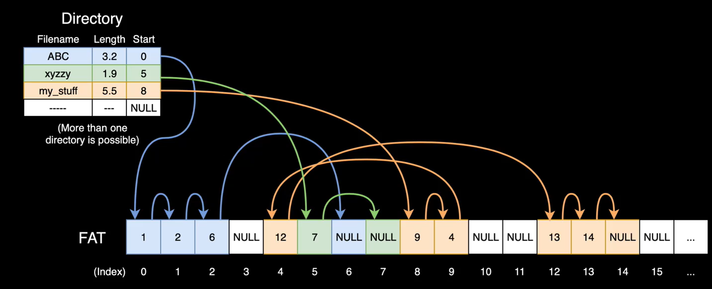
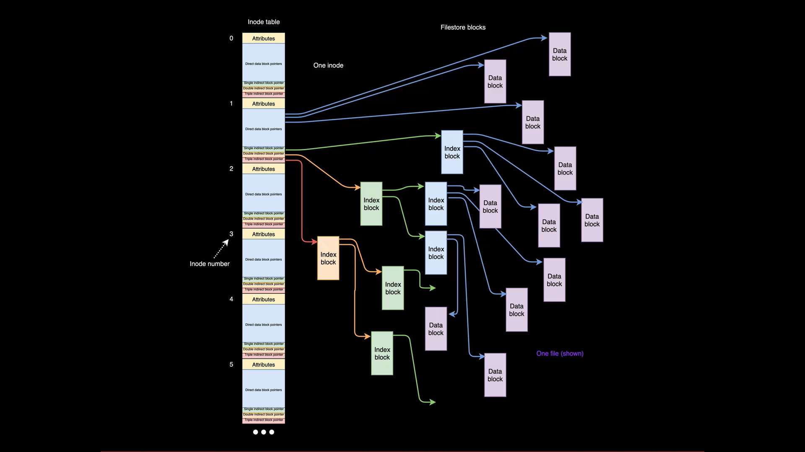

# File Systems I

# File Allocation Table (FAT) File System

* A simplistic form of file allocation that does not require an underlying operating system.
* Contains both a directory and a data section. 
* The data section is broken up into blocks of data of a fixed size.
* The Directory contains info like the filename, the length of a file and the block that it starts on. 
* Blocks are usually small like `4KB` or `1KB` hence the end of the data block points to the address of the next data block in that file.
* The end of the block is NULL if that is the end of that specific file.

## Issues with FAT
* If the files on the filesystem are small, the directory can become full before the data section is full. Thus no more new files can be created.
* This is an issue as the size of the data and directory sections are created when the disk is first formatted.
* The opposite issue occurs if the files are too large however given that the directory is usually small, this is a non-issue.

# UNIX File Systems

* In UNIX File Systems, all files in the operating system including those in different devices exist under the same file system. 
* Like FAT, there is a directory table called the INODE table where each inode contains the following:
    * An Attributes section that contains data on permissions etc.
    * A pointer block who's pointers that point directly to data blocks.
    * A pointer that points to another pointer block who's pointers point to data blocks. (Single Indirect Block)
    * A pointer that points to another pointer block who's pointers point to other pointer blocks. (Double Indirect Block). 
    * A pointer that does the same as above but with 3 layers of abstraction. (Triple Indirect Block).

## INODE advantages
* The attributes section does not contain the file name, the file name is a special INODE in the INODE Table that points to some data.
* Because of the fact that a filename is just part of the INODE table, multiple filenames can point to the same file.
* When moving data to a different part of the filesystem, the data does not need to be moved, only the filename INODE needs to be updated, thus moving files happens instantaneously regardless of size.