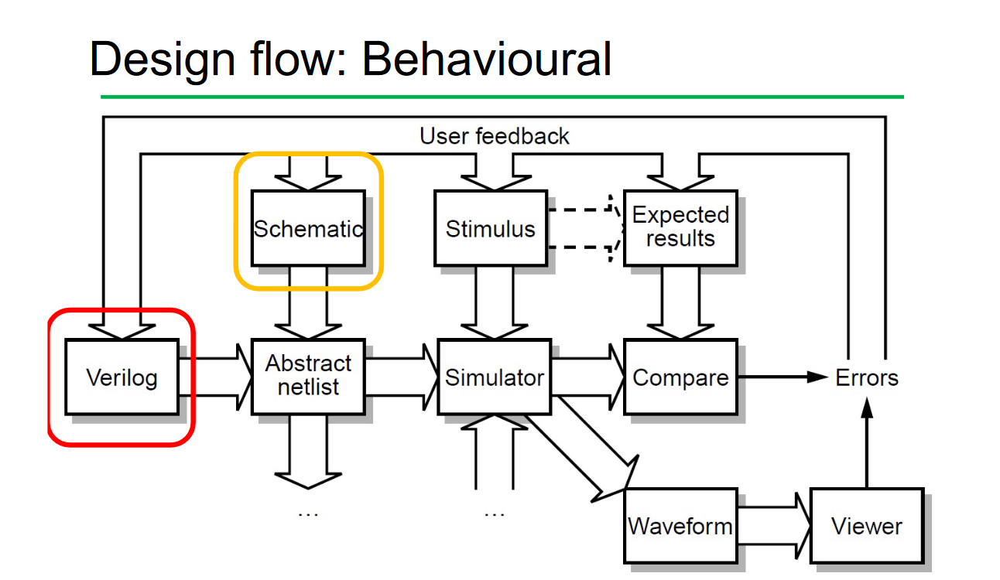
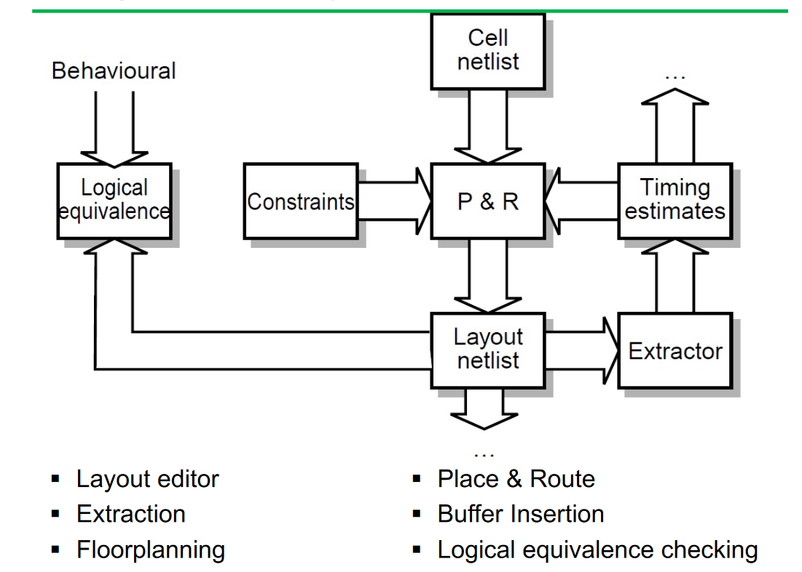

# Computer Aided Design Tools

## Step 1: Specifying the Behaviour
* The behaviour of the chip is defined using verilog or other `Hardware Design Languages`.
* This design is then `tested` using a simulator to ensure that the outputs are correct for the specified given inputs.
* The output of this step is an `abstract netlist` that specifies the list of electronic components in the chip and their connections. It is abstract as it does not map to a specific target technology.

## Step 2: Mapping to a Target Technology
* The `synthesiser` takes the `abstract netlist` and maps it to the primitives of the target technology. 
* There are constraints of the target technology that need to be worked around as different target technologies have different constraints and some verilog functionality cannot directly be created in hardware. (Eg the xilinx synthesiser can directly map multiplication as the hardware exists on the FPGA but this is not guaranteed.)
* The constraints usually are in the form of area or speed requirements, eg using a ripple carry adder that has an `O(N)` time complexity vs a carry look ahead adder that has an `O(log2(N))` complexity but needs 2-3x more logic gates.
* The output is either:
    * A flattened netlist that directly maps all of the components and their connections, allowing for greater flexibility of representation at the cost of human readability and larger data requirements.
    * A hierarchical netlist that is mapped to the target technology.

## Step 3: Physical Design

### Design Constraints to Consider
* The physical design of the processor has many `antagonistic constraints` that need to be worked around.
* `Clock Period`: Components in the design must be physically fast enough to abide by the clock period of the processor. 
* `Floorplan`: How the major functional blocks of the chip are placed. 
* `Area/density`: The maximum area/density of the chip based on the target technology and external factors. 
* `Power Requirements`

### Floorplanning

* The physical layout of the components in the chip has many constraints: 
    * `Bonding paths`: Paths for off chip connections are placed around the circumference usually.
    * `Amplifier Circuits`: Are used to amplify the current for connections to bonding paths and are large and need to be located close to the bonding paths.
    * `Reducing the amount of data paths`: Areas that communicate often should be placed close together to reduce the amount of space dedicated to datapaths, to improve the speed of the processor and to improve signal integrity.
    * `Purchased IP Blocks`: IP Blocks often have constraints with regards to not having signals passing above them/ needing to be placed in a specific criteria.
* Tools for floorplanning:
    * `Layout editor`: Drawing the features that will appear as wires/ transistors etc. They give a plan view of the chip. Once completed, it is extracted with an `extractor` that results in a schematic of what is present.
    * `Place and Route`: After components are placed on the silicon, `P&R` will interconnect the components with wires.
    * `Buffer Insertion`: The wiring from the router can slow down switching edges too much hence `driving gates` can be substituted with stronger ones that are often larger. If this is not possible, The signal can be buffered by amplifiers that need to be located close to the path that is being amplified. (if they are not close, the amplification is useless)

## Step 4: Design Checking

* `Design Rule Checking` Checking that all the polygons on the floorplan obey the maximum/ minimum widths and clearances.
* `Electrical Rule Checking`: Checks on power supplies/ voltages to ensure that signal integrity is not lost.
* `Layout vs Schematic`: Checking that the layout matches the design supplied by the `abstract netlist`.

## Step 5: Validation with Tolerances
* Physical chips need to work in a wide range situations even with `manufacturing process variations`, `variable operating voltages` and `variable chip temperatures`.
* Thus simulations need to be run at extremes to ensure that chips run at the wide range of operations.