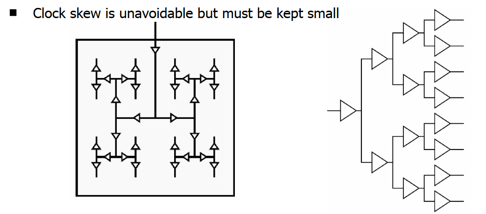

# Timing and Clocking

## Definitions
* `Clock period`: The time taken for a clock cycle that is determined by the delay introduced by the combinatorial logic to perform computations in 1 cycle.
* `IPC`: Instructions per clock
* `Latency`: Time taken to finish a fixed task.
* `Throughput`: Number of tasks in a fixed time.
* `Timing closure`: The process by which a logic design consisting of primitive elements and sequential logic gates is modified to meet its timing requirements.

## Clock Period
* The `minimum clock period (maximum frequency)` is hard to estimate when the layout is not complete.
* However, it is important to know it in the design phase as it is important to know how many clock cycles each block of combinatorial logic takes to ensure the simulations are accurate.
* At the gate level, the clock period is set roughly by the gate depth between registers.
* Thus the `minimum allowed clock period` is determined as the sum of: 
    * The propogation delay of the source register.
    * Propogation delay of the logic. 
    * Set up time of the target register.
    * Additional time for uncertainty.

## Finding the Bounds for the `clock period`
* The accuracy of any result requires knowledge of gate strengths, wire load and layout details hence these bounds are estimates.
* These estimates are useful to check if the implementation strategy is feasible.

### Method: `Simulation`
* Can indicate well if a system will fail at a particular clock speed.
* Not reliable unless the critical path is known and tested beforehand or the test bench is exhaustive of all possible states.

### Method: `Static Timing Analysis`
* The sum of the delay from all the critical paths between flip flops with setup and hold time violations. 
* Gives the absolute upper bound on time taken, however this critical path may never be taken for any inputs hence can be an overestimate.
* It is quick to calculate.

## Clock Distribution

* The synchronous model assumes all flip flops are clocked simultaneously.
* Thus it is important to ensure that the clock signal reaches all the flip flops at the same time to prevent `clock skew`.
* A `H tree` can be used to ensure all clock paths are balanced in `drive`, `load` and `wire length`.

## Clock Domains
* Complex systems may require more than 1 clock signal.
* This can be achieved with:
    * The same clock signal with shifted phase.
    * Multiples/ divisions of a main clock
    * Independent clocks.
* The designs need to be partitioned for the different `clock domains` as setup and hold time violations can arise if the boundary is broken.
* However, a `synchroniser` can be used to resolve the `metastability`.

