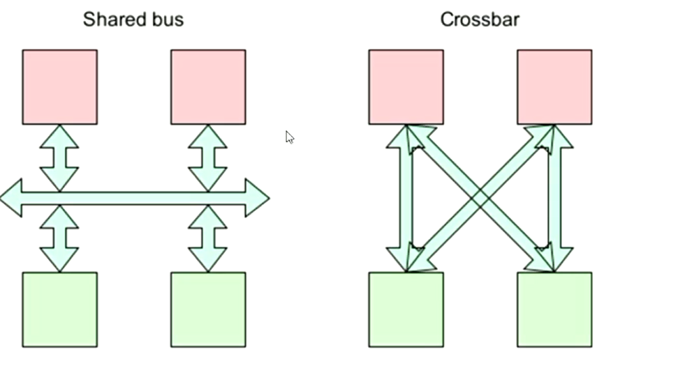
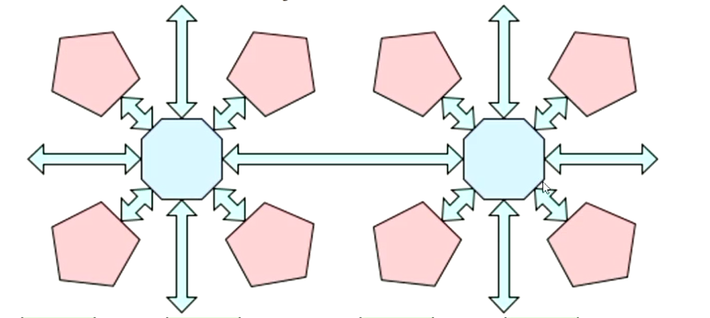
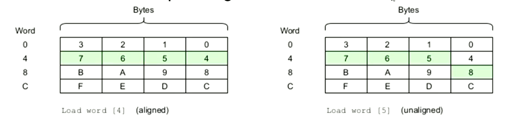

# Interconnection

## Definitions
* `Bus`: A logical terminlogy that encompasses the aspects of data transfer between the processors and memory.

## Communication betweeen Processor and Memory
* `Address`: The processor defining which address data is either to be read or written to.
* `Data`: The data that is being read or written to the processor from the memory.
* `Size`: Referring to the size of the data space that should be written to the memory or read into the processor.
* `Timing/Enable`: Referring to if the data is valid to be read or written eg read-enable or write-enable.
* `Privilege`: The processor tells the memory the privelege level of the program currently requesting the memory, thus the memory is able to either return the data if the program has the right privileges or return an error.

## Interconnection

* System architectures are very complex with many devices, hence multiple components can be connected using either a shared bus or a switched bus.
	* `Single/Shared bus`: Simple, scales easily but can bottleneck.
	* `Crossbar/ Switch bus`: Offers parallelism but connection amounts scale with $O(N^2)$ 
* Sharing can be done by giving specific components different time slices/ clock cycles to use the bus.

## Network on Chip Interconnection

* Offers a message transfer system through shared messaging routers.
* Routers forward messages between the nodes of the network depending on the requested destination and source.

## Bus Alignment

* Busses have specific widths, which can lead to either errors or misaligned operations wherein loading a word from an address that doesn't start at the MSB/LSB of the bus can take multiple operations.

## Endianness
* Whether the least significant byte is at the lowest address (little endian) or most significant byte is at the lowest address (big endian).
* Little endian is more common.

## Computing Architectures
* `Von Neumann`: Code and data are stored in the same memory and use the same bus. Most mainstream processors use this architecture in the software view, though that can be an abstraction over the actual architecture.
	* The abstraction is done by having a 'soft partition' in memory separating the code and data so the processor has a harvard interface and the code has a von neumann interface. 
	* This allows for multiple busses and caches to be used for each type of data. This leads to higher performance as instruction and memory fetches can occur at the same time.
* `Harvard`: Separate address spaces and busses for code and data.
	* Allows for more engineering flexibility as data and instruction words can be different sizes.