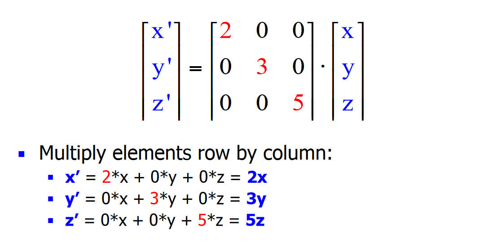
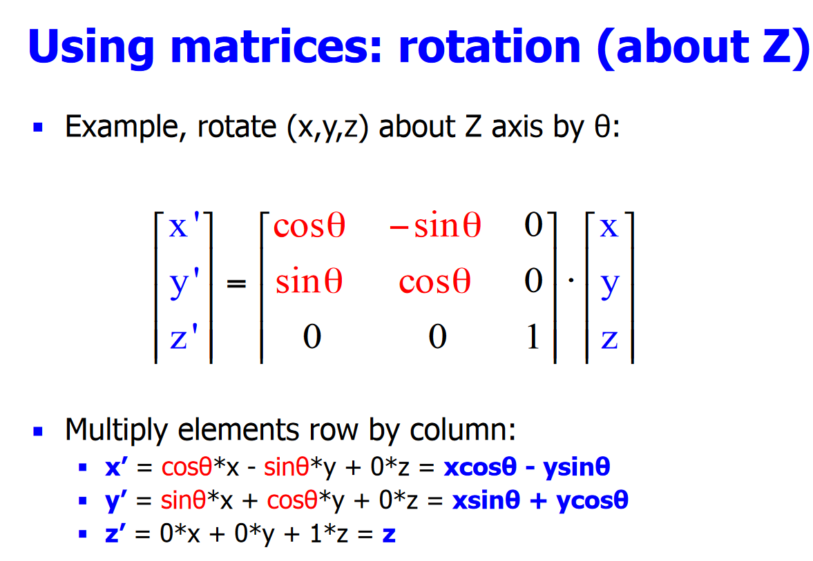
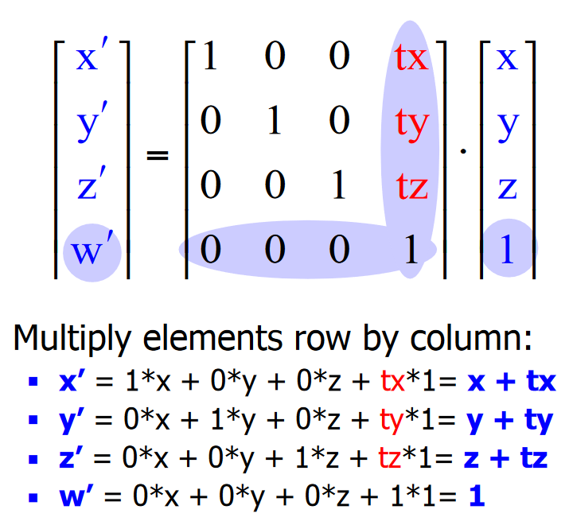

# Transformations

## 3D Coordinates
* `3D Cartesian Coordinates`: A representation of points in space in reference to some origin point.
* `Vectors`: Uses a 3D coordinate to represent a direction based on the difference between the coordinate of the vector and the origin.

## Transformations
* `Displacements`: Objects can be displaced by adding the x, y and z transformation amounts to the respective x y and z coordinates.
```python
new_x = x + tx
new_y = y + ty
new_z = z + tz
```
* `Scaling`: Objects can be scaled by multiplying the x, y and z scaling amounts to the respective x y and z coordinates.
```python
new_x = x * tx
new_y = y * ty
new_z = z * tz
```
* `Rotation`: Rotating about the origin can be done by the following equations:
	* These equations are for rotating on the XY plane which is perpendicular to Z.
	* To rotate about a different point, scale back to the origin, do the rotation and apply the inverse of the original scale.
	* To rotate about an arbitrary vector, transform the vector such that it is `collinear` with one of the axes, apply the rotation and then apply the inverse of the transformations that were made on the vector.
		* Shift the vector to the origin.
		* Rotate it about the X axis until it is within the XY plane.
		* Rotate it about the Z axis until it is coincident (parallel and from the same origin) with the X axis.
		* Do the rotation.
		* Do the inverse of the above steps.
```python
new_x = (x * cos(rotation_angle)) - (y * sin(rotation_angle))
new_y = (x * sin(rotation_angle)) + (y * cos(rotation_angle))
new_z = z
```

## Matrix Transformations
* Matrices can be used for the above transformations.
* `Scaling`: The x, y and z coordinates are placed diagonally from top left to bottom right into a square 0 matrix. This matrix is then multiplied by the column representation of the coordinates.

* `Rotation`: Rotation can be done using the following matrix:

* `Displacement`: The coordinate needs to be converted to a `homogenous coordinate` that has an extra `w` coordinate which represents a 4th spatial dimension. For 3D spaces, it is usually set to `1`.
