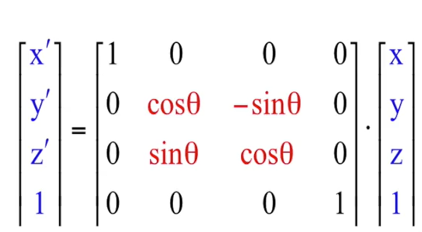
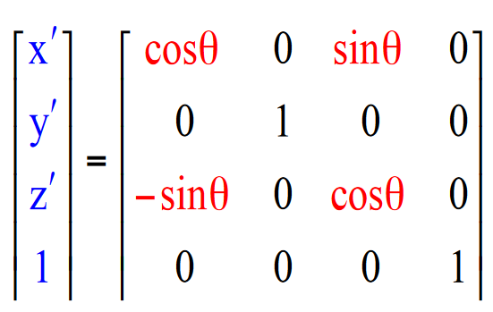
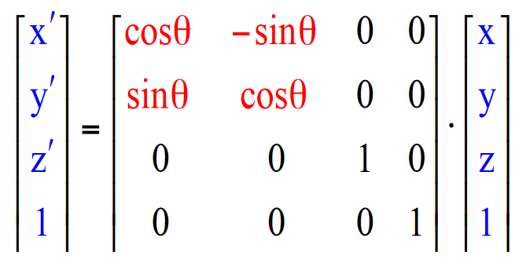

# Homogenous Coordinates

* In order to use a consistent matrix representation for all kinds of linear transformations, an extra `w` coordinate is added to the usual 3d coordinate system.
* Usually it is 1, however `normalisation` is needed when it is not.
* The `w` coordinate represents a 4th spatial dimension.

## Transformations with Homogenous Coordinates
* `Scaling`: The bottom right coordinate of the original scaling matrix is set to `1`.
* `Displacement`: The same as the original. 
* `Rotation`: Is different for rotation about each axis.

### X Axis

### Y Axis

### Z Axis

## Composite Matrices
* Since all transformations use matrices with the same dimensions, composite transformations where all the matrices to perform the transformation can be done by multiplying all the translations in order and only then multiplying with the coordinates to be transformed.
* This is helpful for rotation operations as the displacement to origin, rotation and inverse displacement to origin can be combined into 1 matrix transformation.

## Inverse Matrices
* Two matrices are inverses of each other if multiplying them returns the `identity matrix`.
* The identity matrix is the matrix of 1s diagonally from top left to bottom right, with 0s otherwise.
* Not all matrices have inverses as information can be lost. They are called `singular`.