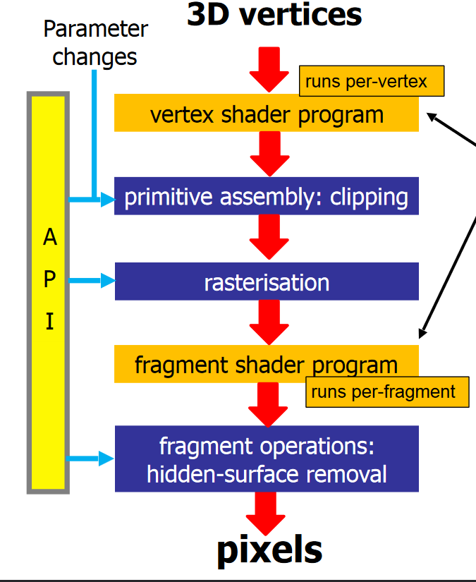

# Shaders

* Graphics pipelines take a series of 3D vertices, and apply transformations to create a set of pixels to be displayed.
* In a programmable pipeline, the `vertex shader program` and the `fragment shader program` are reprogrammable portions of the pipeline that can be programmed in a `shading language`.
* Shaders can be attached to a specific mesh.


## Vertex Shader
* Is run once per vertex.
* Is used to set the position of the vertex on screen by setting the `gl_position` variable which is a `vec4`.
* This information eventually reaches the `fragment shader`.
* If one is not provided, the default is used, explained: [[3_Transformations_in_OpenGL]] :
```C
void main() {
	gl_Position = ProjectionMatrix * modelViewMatrix * vec4(position, 1.0);
}
```

## Fragment Shader
* Is run once per fragment.
* Takes place after the vertex shader and rasteriser (there are also some other things beforehand).
* Fragments refer to the pixels that reside within a vertex on the screen.
* It is used to give a color to the pixels in the fragment.
* A simple fragment shader:
```C
void main() {
	gl_FragColor = vec4(1.0, 0.0, 1.0, 1.0);
}
```

## Shader Variables
* Shaders require data to be operated on and are passed to them as either `uniforms`, `attributes` or `varyings`.

### Uniforms
* Sent to both vertex and fragment shaders.
* Usually single values.
* They stay constant throughout the frame.

### Attributes
* Only applies to the vertex shader.
* Are values applied to individual vertices.
* Can be passed as an array of attributes, one per vertex.

## Varyings
* Variables that are declared in the vertex shader that are shared with the fragment shader to share information between them.
* The varying variable needs to be declared in both shaders.
